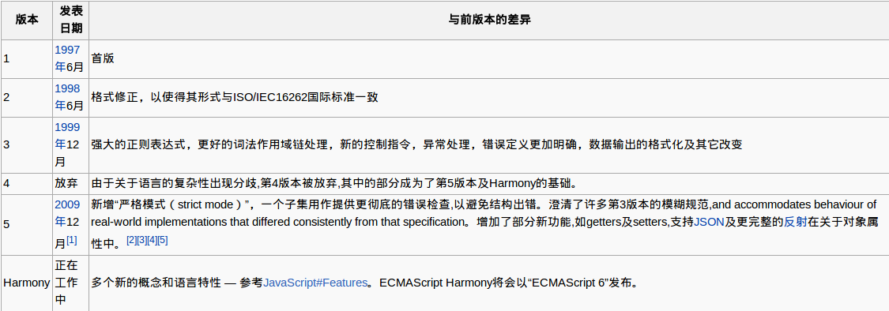

##[前言]##

这几天上网无意间看到一个新名词：Javascript Harmony。联想到以前的ES 5等，瞬间让我觉得我对javascript的相关版本的概念一直都很模糊。因此决定好好收集整理下相关的信息。

##[正文]##

### 1. Javascript的定义###

一个完整的 JavaScript 实现是由以下 3 个不同部分组成的:

*	核心（ECMAScript）
*	文档对象模型（DOM）
*	浏览器对象模型（BOM）

#### 1.1 ECMAScript ####

ECMAScript是一种由[Ecma国际](https://zh.wikipedia.org/wiki/Ecma%E5%9B%BD%E9%99%85)（[前身为欧洲计算机制造商协会](https://zh.wikipedia.org/wiki/%E6%AC%A7%E6%B4%B2%E8%AE%A1%E7%AE%97%E6%9C%BA%E5%88%B6%E9%80%A0%E5%95%86%E5%8D%8F%E4%BC%9A)）通过ECMA-262标准化的脚本程序设计语言。

ECMAScript 仅仅是一个描述，定义了脚本语言的所有属性、方法和对象，并不与任何具体浏览器相绑定。实际上，它也没有提到用于任何用户输入输出的方法（这点与 C 这类语言不同，它需要依赖外部的库来完成这类任务）。Web 浏览器对于 ECMAScript 来说是一个宿主环境，但它并不是唯一的宿主环境。事实上，还有不计其数的其他各种环境（例如 Nombas 的 ScriptEase，以及 Macromedia 同时用在 Flash 和 Director MX 中的 ActionScript）可以容纳 ECMAScript 实现。

ECMAScript 描述了以下内容：

*	语法
*	类型
*	语句
*	关键字
*	保留字
*	运算符
*	对象

JavaScript只是ECMAScript的实现和拓展。

#### 1.2 文档对象模型（DOM） ####

DOM（文档对象模型）是 HTML 和 XML 的应用程序接口（API）。DOM 将把整个页面规划成由节点层级构成的文档。DOM定义了表示和修改文档所需的对象、这些对象的行为和属性以及这些对象之间的关系。可以把DOM认为是页面上数据和结构的一个树形表示，不过页面当然可能并不是以这种树的方式具体实现。

通过 DOM API，你可以重构整个HTML文档。你可以添加、移除、改变或重排页面上的项目。

##### 1.2.1 DOM的不同的部分 #####

*	Core DOM	
	
	定义了一套标准的针对任何结构化文档的对象	

*	XML DOM	
	
	定义了一套标准的针对 XML 文档的对象	

*	HTML DOM	
	
	定义了一套标准的针对 HTML 文档的对象。

##### 1.2.2 DOM的各个level #####

*	Level 1	
	
	标准分为两部分，Core和HTML。Core定义了用于表示结构化文档的基础接口的同时，也定义了用于表示XML文档的拓展接口。HTML则提供了更为高层的接口，以更加方便处理文档。

*	Level 2	

	标准分为6个部分：DOM2 Core，Views，Events，Style，Traversal，Range以及DOM2 HTML。	

*	Level 3	
	
	标准分为5个部分：DOM3 Core， Load and Save，Validation，Events以及XPath。

更加详细的信息您可以参考[MDN文档](https://developer.mozilla.org/en-US/docs/DOM_Levels)。

##### 1.2.3 其他DOM #####

除了 DOM Core 和 DOM HTML 外，还有其他几种语言发布了自己的 DOM 标准。这些语言都是基于 XML 的，每种 DOM 都给对应语言添加了特有的方法和接口：

#### 1.3 浏览器对象模型（BOM）####

IE 3.0 和 Netscape Navigator 3.0 提供了一种特性 - BOM（浏览器对象模型），可以对浏览器窗口进行访问和操作。使用 BOM，开发者可以移动窗口、改变状态栏中的文本以及执行其他与页面内容不直接相关的动作。使 BOM 独树一帜且又常常令人怀疑的地方在于，它只是 JavaScript 的一个部分，没有任何相关的标准。

BOM 主要处理浏览器窗口和框架，不过通常浏览器特定的 JavaScript 扩展都被看做 BOM 的一部分。这些扩展包括：

*	弹出新的浏览器窗口
*	移动、关闭浏览器窗口以及调整窗口大小
*	提供 Web 浏览器详细信息的定位对象
*	提供用户屏幕分辨率详细信息的屏幕对象
*	对 cookie 的支持
*	IE 扩展了 BOM，加入了 ActiveXObject 类，可以通过 JavaScript 实例化 ActiveX 对象

### 2. Javascript的历史 ###

目前所有的主流 Web 浏览器都支持 ECMA-262 第三版，即JavaScript 1.5版本，JavaScript 1.6-1.9只是ECMAScript (JavaScript on Gecko)升级至JavaScript 2.0的临时代号。从图中你会发现没有ECMAScript 4th。这是因为在ECMAScript 4th标准的制定过程中，由于关于语言的复杂性出现分歧,第4版本被放弃,其中的部分成为了第5版本及Harmony的基础。

### 3. Javascript的未来 ###

大家都知道JavaScript这门语言在设计上有些地方存在缺陷，比如只有函数级作用域没有块级作用域，比如this绑定的问题，比如一直都让我很困惑的constructor等等。作为一门脚本语言，JavaScript又非常之灵活，你可以随意指定对象实例而不必定义类，大规模程序开发过程中，这一点其实也相当痛苦：难以快速重构和寻找调用点。

其实在我看来JavaScript发展趋势大概有这么两种：

	1.	改良，也就是下一代的ES 6，代号Harmony
	2.	取代，比如非常流行的CoffeeScript，谷歌主导的Dart，还有微软的TypeScript

#### 3.1 ECMAScript 6 ####

在2007年，浏览器市场巨头(Mozilla、Microsoft、Adobe、Google和Opera)之间合作和联合的氛围逐渐瓦解，设计师们提出了一份ES4提案，即ECMAScript标准的第4个版本。这将是JavaScript历史上最重大的标准升级，它为JavaScript引入了一些重要的新功能，例如基于类的继承、名称空间以及迭代器。但是各个厂商关于标准的实现方面出现了严重的分歧，采用该新标准的厂商并不多，因此该标准难以成为一个切实可行的技术标准。

在一个无法使用的标准制定过程中投入太多的精力并没有什么意义，因此第二个工作组随之形成。该工作组首先由Microsoft和Yahoo!组成，他们并行地提出了一个更加现代的ECMAScript标准的修订版，解决了一些迫切的而又不容易引起争论的需求。这个新的标准就是ES3.1(即ECMAScript 3.1版)，随后更名为ES5。

ES5的初衷是成为ES4所定义的标准和ES3中已经实现的标准之间的中间版本。ES5曾经被更多地描述为某种程序错误修正的版本，而不是一个主要的标准升级版本。这两个工作组试图协调各自的努力，以便将ES3.1中的改变推进到ES4中。由于在基本主张上存在差异，两个标准之间的共同点实在太少，很显然这种协调难以取得成功。新标准的制定工作再次陷入停顿状态。然而，Adobe公司在最新的Flash引擎和Flex开发(ActionScript 3)中已经采用了ES4标准。但就目前的状况而言，ES4似乎已经看不到什么未来。最后，两个工作组不得不求同存异而走到一起，以便双方都可以将标准推向前进。人们将这个新的、完全不同的项目称为“ECMAScript Harmony”，它几乎没有保留源自ES4标准的内容。

**Harmony是ES6的代号。**

您可以在MDN上查看[FF对ECMAScript 6的支持情况](https://developer.mozilla.org/en-US/docs/JavaScript/ECMAScript_6_support_in_Mozilla)，另外可以在官方的WIKI上面浏览[ECMAScript 6草案](Ecma-262 Edition 6)

<!-- http://hax.iteye.com/blog/1122103 -->
<!-- ECMAScript 5 compatibility table -->
<!-- http://kangax.github.io/es5-compat-table/ -->

#### 3.2 CoffeeScript ####

#### 3.3 Google Dart ####

官方主页：http://www.dartlang.org/
<!-- http://www.guao.hk/posts/google-to-unveil-dart-programming-language.html -->

#### 3.4 TypeScript ####

http://www.typescriptlang.org/

[参考文档]

1.	[JavaScript 实现](http://www.w3school.com.cn/js/pro_js_implement.asp)
2.	[各个版本的javascript新特性](https://developer.mozilla.org/en-US/docs/JavaScript/New_in_JavaScript)
3.	[the future of javascript](http://blog.chromium.org/2012/02/future-of-javascript-take-peek-today.html)
4.	[ECMAScript](https://zh.wikipedia.org/wiki/ECMAScript)
5.	[ECMAScript Harmony](https://mail.mozilla.org/pipermail/es-discuss/2008-August/006837.html)
6.	[John Resig-ECMAScript Harmony](http://ejohn.org/blog/ecmascript-harmony/)
7.	[Late binding](http://en.wikipedia.org/wiki/Late_binding)
8.	[ECMAScript 6 support in Mozilla](https://developer.mozilla.org/en-US/docs/JavaScript/ECMAScript_6_support_in_Mozilla)
9.	[[译]ECMAScript.next:TC39 2012年9月会议总结](http://www.cnblogs.com/ziyunfei/archive/2012/10/23/2734508.html)
10.	[New JavaScript Engine Module Owner](http://brendaneich.com/2011/06/new-javascript-engine-module-owner/)
11.	[还原JavaScript的真实历史](http://blog.csdn.net/aimingoo/article/details/1932315)
12.	[详图实证：再谈JavaScript的语源问题](http://kb.cnblogs.com/page/140723/)
13.	[ECMAScript](http://book.51cto.com/art/201006/207147.htm)