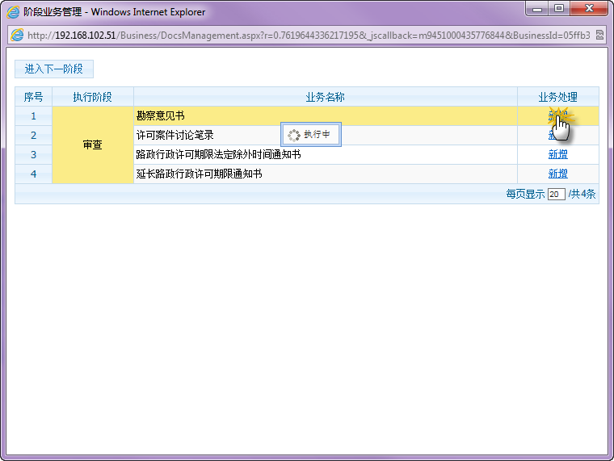
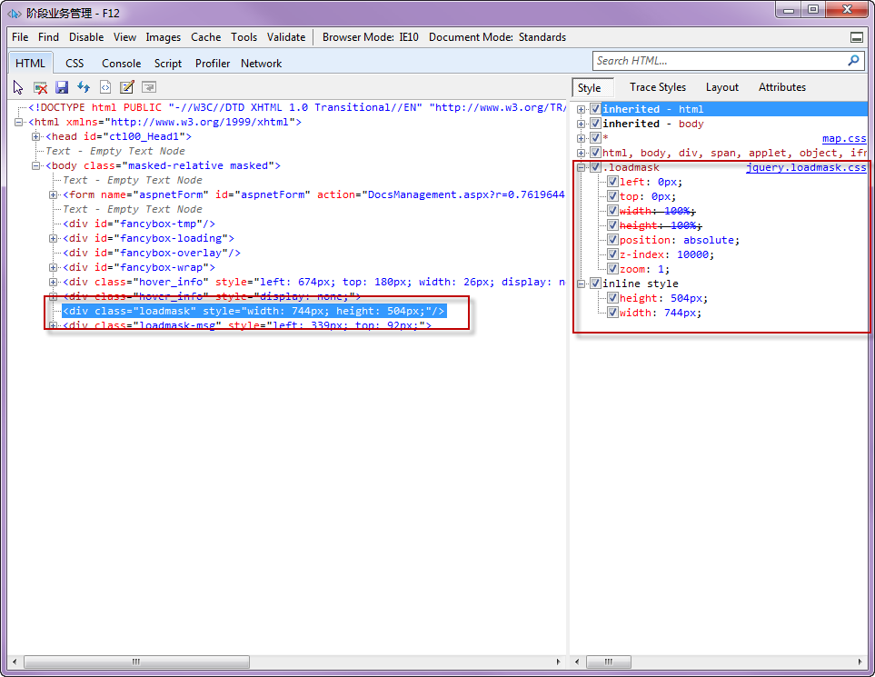
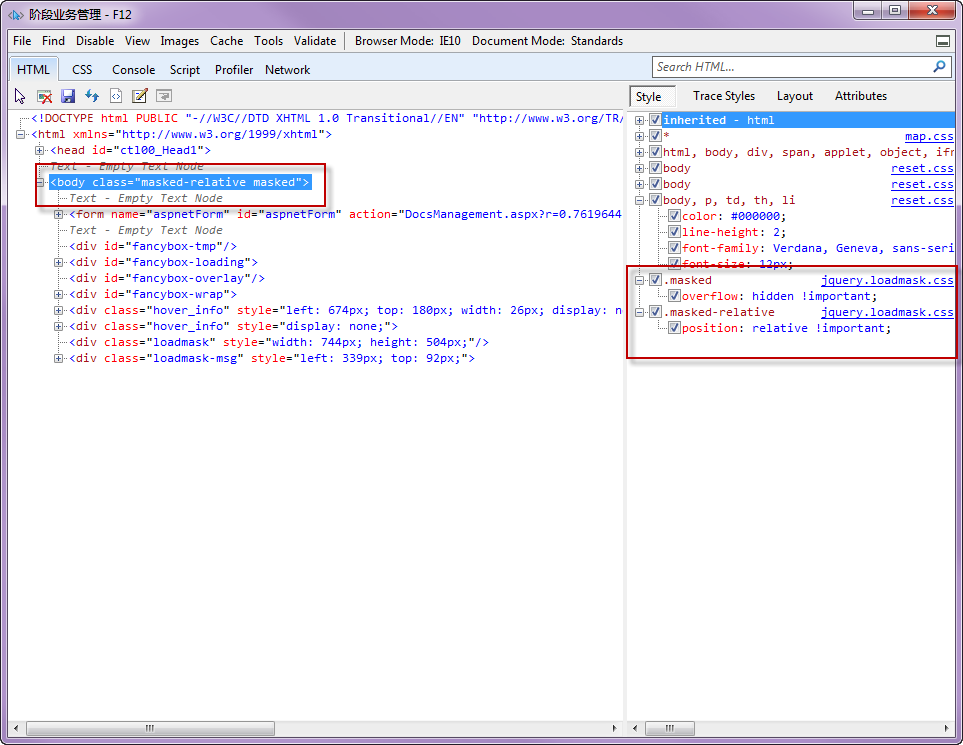

##问题描述##

使用[loadmask.js](https://code.google.com/p/jquery-loadmask/)做loading样式的时候，loadmask库创建了一个div.loadmask的遮罩层。这个遮罩层在Chrome，Opera，Safari，Firefox下**正确遮罩住z-index比它小的元素**，但是在IE下失败了。

也就是说，**在IE系列的浏览器下，z-index没有生效**。

在**zIndex错误页面**，正常情况下，位于**遮罩层后面**的元素（比如“新增”按钮）应该是**无法点击**的，但是因为IE浏览器z-index的BUG，导致现在我们依然可以点击新增按钮：

**div.loadmask**的样式如下所示：

loadmask.js动态添加在**body**元素上的样式如下所示：

##解决方案##

在上图所示的loadmask类中，加入以下CSS样式，即可搞定问题：
	
	background-color:white;
	opacity: 0;
	filter: alpha(opacity=0);/*for IE5-7*/ 
	-ms-filter:"progid:DXImageTransform.Microsoft.Alpha(Opacity=50)";/*for IE8*/

##问题产生的原因##

	

##参考文档##

1.	[Overlapping And ZIndex](http://css-discuss.incutio.com/wiki/Overlapping_And_ZIndex)
2.	[Squish the Internet Explorer Z-Index Bug](http://www.brenelz.com/blog/squish-the-internet-explorer-z-index-bug/)
3.	[Fiddler – Put a breakpoint in your network traffic…](http://blog.alner.net/archive/2008/10/06/fiddler-ndash-put-a-breakpoint-in-your-network-traffichellip.aspx)