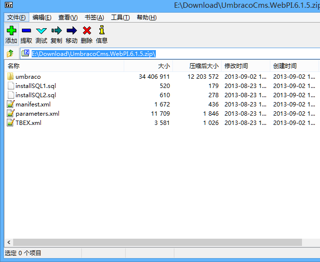

##Microsoft Web Platform Installer##

**PI v1.0**在2009/1/21发布，是一个用于安装微软整体WEB平台的简单免费的工具。微软WEB平台包含了以下组件：

+	IIS
+	Visual Web Developer 2008 Express Edition
+	Microsoft SQL Server 2008 Express Edition
+	.NET Framework
+	Silverlight Tools for Visual Studio
+	PHP
+	其他更多

**PI v2.0**在2009/9/24发布，引入了自动安装第三方WEB软件的功能，例如：

+	WordPress
+	Umbraco
+	Drupal
+	Joomla!
+	Orchard
+	其他更多。你可以通过[在线软件列表](http://www.microsoft.com/web/gallery/)浏览其他通过PI发布的软件。

**PI v3.0**在2010/7/7发布，这个版本中，微软发布了WebMatrix Beta版，是一个WEB开发集成工具。

Web PI可以在[Microsoft Web Platform website](http://www.microsoft.com/web/)下载。

>NOTE:
>
>这边插入一个题外话，就是关于WEB PI中的WEB APP。我在看WEB PI的时候一直有一个疑问，就是Gallery里面的WEB APP是怎么来的。
>这个问题其实也很好回答，就是WEB APP的开发者，把自己的WEB APP封装好，以便支持微软的Web App Gallery。之后提交到Web App Gallery,微软审查通过之后，就会出现在Web App Gallery列表中。

>关于如何封装WEB APP以支持Web App Gallery，请参考[这些相关文档](http://www.iis.net/learn/develop/windows-web-application-gallery)。尤其是这篇[Reference for the Web Application Package](http://www.iis.net/learn/develop/windows-web-application-gallery/reference-for-the-web-application-package)文档。
>[Reference for the Web Application Package](http://www.iis.net/learn/develop/windows-web-application-gallery/reference-for-the-web-application-package)文档中指出，一个WEB APP至少需要两个额外的文件，分别是Manifest.xml以及Parameters.xml。
>
>当然，两个文件都是打包在WEB APP的ZIP包里的。
>
>以UmbracoCms为例，我们可以在[下载页面](http://our.umbraco.org/contribute/releases/615)下载到UmbracoCms.WebPI.6.1.5.zip这个包。
>
>如果解压开来，你会看到这么一些文件：

>

##Mobile database##

A mobile database is either a stationary database that can be connected to by a mobile computing device - such as smart phones or PDAs - over a mobile network, or a database which is actually carried by the mobile device.

<table>
<thead><tr>
<th class="headerSort" tabindex="0" role="columnheader button" title="Sort ascending">Name</th>
<th class="headerSort" tabindex="0" role="columnheader button" title="Sort ascending">Developer</th>
<th class="headerSort" tabindex="0" role="columnheader button" title="Sort ascending">Type</th>
<th class="headerSort" tabindex="0" role="columnheader button" title="Sort ascending">Description</th>
</tr></thead><tbody>
<tr>
<td><a href="/wiki/SQL_Anywhere" title="SQL Anywhere">SQL Anywhere</a></td>
<td><a href="/wiki/Sybase_iAnywhere" title="Sybase iAnywhere">Sybase iAnywhere</a></td>
<td><a href="/wiki/Relational_database" title="Relational database">Relational</a></td>
<td>Embedded/portable database, can synchronize with stationary database</td>
</tr>
<tr>
<td><a href="/wiki/DB2_Everyplace" title="DB2 Everyplace" class="mw-redirect">DB2 Everyplace</a></td>
<td><a href="/wiki/IBM" title="IBM">IBM</a></td>
<td>Relational</td>
<td>Portable, can synchronize with stationary database</td>
</tr>
<tr>
<td><a href="/wiki/IBM_Mobile_Database" title="IBM Mobile Database" class="mw-redirect">IBM Mobile Database</a></td>
<td><a href="/wiki/IBM" title="IBM">IBM</a></td>
<td>Relational</td>
<td>Portable/embedded small-footprint version of <a href="/wiki/SolidDB" title="SolidDB">solidDB</a> server</td>
</tr>
<tr>
<td><a href="/wiki/SQL_Server_Compact" title="SQL Server Compact">SQL Server Compact</a></td>
<td><a href="/wiki/Microsoft" title="Microsoft">Microsoft</a></td>
<td>Relational</td>
<td>Small-footprint embedded/portable database for <a href="/wiki/Microsoft_Windows" title="Microsoft Windows">Microsoft Windows</a> mobile devices and desktops, supports synchronization with <a href="/wiki/Microsoft_SQL_Server" title="Microsoft SQL Server">Microsoft SQL Server</a></td>
</tr>
<tr>
<td><a href="/wiki/SQL_Server_Express" title="SQL Server Express">SQL Server Express</a></td>
<td><a href="/wiki/Microsoft" title="Microsoft">Microsoft</a></td>
<td>Relational</td>
<td>Embedded database, free download</td>
</tr>
<tr>
<td><a href="/wiki/Oracle_Database" title="Oracle Database">Oracle Database</a> Lite</td>
<td><a href="/wiki/Oracle_Corporation" title="Oracle Corporation">Oracle Corporation</a></td>
<td></td>
<td>Portable, can synchronize with stationary database</td>
</tr>
<tr>
<td><a href="/wiki/SQLite" title="SQLite">SQLite</a></td>
<td><a href="/wiki/D._Richard_Hipp" title="D. Richard Hipp">D. Richard Hipp</a></td>
<td>C programming library</td>
<td>Public domain</td>
</tr>
<tr>
<td><a href="/wiki/SQLBase" title="SQLBase" class="mw-redirect">SQLBase</a></td>
<td><a href="/wiki/Gupta_Technologies" title="Gupta Technologies">Gupta Technologies</a> LLC of Redwood Shores, California</td>
<td></td>
<td></td>
</tr>
<tr>
<td><a href="/w/index.php?title=HanDBase&amp;action=edit&amp;redlink=1" class="new" title="HanDBase (page does not exist)">HanDBase</a></td>
<td><a href="/w/index.php?title=DDH_Software&amp;action=edit&amp;redlink=1" class="new" title="DDH Software (page does not exist)">DDH Software</a> Inc. of Lake Worth, Florida</td>
<td></td>
<td></td>
</tr>
<tr>
<td>Cellica Database</td>
<td><a href="/w/index.php?title=Cellica_Corporation&amp;action=edit&amp;redlink=1" class="new" title="Cellica Corporation (page does not exist)">Cellica Corporation</a> of New York<a href="#cite_note-3">[3]</a></td>
<td></td>
<td><a href="/wiki/IOS" title="IOS">iOS</a>, <a href="/wiki/Android_(operating_system)" title="Android (operating system)">Android</a>, <a href="/wiki/BlackBerry_PlayBook" title="BlackBerry PlayBook">BlackBerry PlayBook</a>, <a href="/wiki/BlackBerry_10" title="BlackBerry 10">BlackBerry 10</a>, <a href="/wiki/Windows_Phone_8" title="Windows Phone 8">Windows Phone 8</a>, offers file-based/DSN based access to <a href="/wiki/Microsoft_Access" title="Microsoft Access">Microsoft Access</a>, <a href="/wiki/Sybase" title="Sybase">Sybase</a>, <a href="/wiki/Microsoft_SQL_Server" title="Microsoft SQL Server">Microsoft SQL Server</a>, <a href="/wiki/FileMaker_Pro" title="FileMaker Pro" class="mw-redirect">FileMaker Pro</a>, <a href="/wiki/IBM_DB2" title="IBM DB2">IBM DB2</a>, <a href="/wiki/MySQL" title="MySQL">MySQL</a>, <a href="/wiki/Oracle_database" title="Oracle database" class="mw-redirect">Oracle</a>, and <a href="/wiki/PostgreSQL" title="PostgreSQL">PostgreSQL</a>.</td>
</tr>
<tr>
<td><a href="/w/index.php?title=DataGlass&amp;action=edit&amp;redlink=1" class="new" title="DataGlass (page does not exist)">DataGlass</a> Mobile Database Client</td>
<td><a href="/w/index.php?title=Impathic&amp;action=edit&amp;redlink=1" class="new" title="Impathic (page does not exist)">impathic</a></td>
<td></td>
<td><a href="/wiki/IOS" title="IOS">iOS</a>, offers file-based access to <a href="/wiki/Microsoft_Access" title="Microsoft Access">Microsoft Access</a> databases and client-server access to <a href="/wiki/Sybase" title="Sybase">Sybase</a>, <a href="/wiki/Microsoft_SQL_Server" title="Microsoft SQL Server">Microsoft SQL Server</a>, <a href="/wiki/IBM_DB2" title="IBM DB2">IBM DB2</a>, <a href="/wiki/MySQL" title="MySQL">MySQL</a>, <a href="/wiki/Oracle_database" title="Oracle database" class="mw-redirect">Oracle</a>, and <a href="/wiki/PostgreSQL" title="PostgreSQL">PostgreSQL</a>.[<i><a href="/wiki/Wikipedia:Citation_needed" title="Wikipedia:Citation needed">citation needed</a></i>]</td>
</tr>
<tr>
<td><a href="/w/index.php?title=JDataStore&amp;action=edit&amp;redlink=1" class="new" title="JDataStore (page does not exist)">JDataStore</a> 6</td>
<td><a href="/wiki/Borland" title="Borland">Borland</a></td>
<td><a href="/wiki/SQL92" title="SQL92" class="mw-redirect">SQL92</a></td>
<td>Small-footprint Java database for embedded/portable devices[<i><a href="/wiki/Wikipedia:Citation_needed" title="Wikipedia:Citation needed">citation needed</a></i>]</td>
</tr>
<tr>
<td><a href="/w/index.php?title=MobiSnap&amp;action=edit&amp;redlink=1" class="new" title="MobiSnap (page does not exist)">MobiSnap</a></td>
<td></td>
<td>Relational, SQL</td>
<td>Research project to support applications in mobile environments, dealing with synchronization and intermittent connectivity issues[<i><a href="/wiki/Wikipedia:Citation_needed" title="Wikipedia:Citation needed">citation needed</a></i>]</td>
</tr>
</tbody><tfoot></tfoot></table>

##参考文档##

1.	[Mobile database](http://en.wikipedia.org/wiki/Mobile_database)
2.	[Microsoft Web Platform Installer](http://en.wikipedia.org/wiki/Microsoft_Web_Platform_Installer)