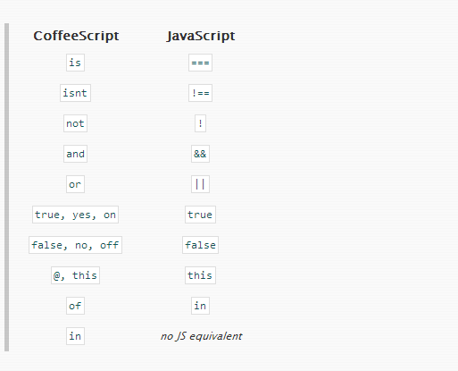

在开始之前，[coffeescript](http://coffeescript.org/)有一个TRY COFFEESCRIPT标签页。它会提供一个在线的coffeescript编译器。左边的是coffeescript代码，而右侧部分则是编译后的js代码。

##代码注释##

和Ruby注释的格式一样，以#开头，后面跟着注释内容即可

    # A comment

当然，多行注释也是支持的，例如

    ###
      A multiline comment, perhaps a LICENSE.
    ###

##变量和作用域##

js有一个潜在的问题就是，当你忘记使用var声明变量的时候，这个变量的作用域就会被提升至全局作用域。

coffeescript修复了这个潜在的问题。coffeescript使用一个匿名函数把你的coffeescript代码包起来，然后所有的变量都使用var声明。

coffeescript代码

    exports = this
    exports.MyVariable = "foo-bar"

会被编译成：
    
    var exports;
    exports = this;
    exports.MyVariable = "foo-bar";

不过当你需要设置全局变量的属性时，我建议你直接使用全局对象（比如在浏览器的环境下，全局对象就是window了）。

##if/else##

流程控制，最基本的应该就是if else 语句了：

    if true == true
      "We're ok"
    if true != true then "Panic"
    # Equivalent to:
    #  (1 > 0) ? "Ok" : "Y2K!"
    if 1 > 0 then "Ok" else "Y2K!"

当然，实际开发过程中，if else 后面会跟着不止一样的表达式，这样的场景下，我们可以这么做：

    if heat < 5
        #   do something
    else
        #   do other things

更进一步的是，coffeescript还允许你像编写ruby代码一样，把if语句放在后面：

    alert（"It's cold!"） if heat < 5

实际上这句代码会被翻译成：

    if (heat < 5) {
      alert("It's cold!");
    }

很神奇吧！我们来看另外一个js代码：

    if (!true) {
      "Panic";
    }

是的，js我们一般使用!做取反操作，但这样的代码其实偏向于给机器阅读，而不是说给人类阅读。换种方式：

    if not true then "Panic"

是否好多了？其实我们还有另外一种表达方式：

    "Panic" unless true

或者：
    
    unless true
      "Panic"

不论是哪一种写法，结果都是一样的。unless === if not。

##操作符和别名##

其他的一些小的变化，比如is关键字会被翻译成===，isnt会被翻译成 !==等，虽然是微小的变化，但是在代码的可读性上却前进了一大步。

    if true is 1
        "Type coercion fail!"

    if true isnt true
        alert "Opposite day!"

##拓展操作符##

我们常常会有这么一个场景，就是判断一个变量是否为null或者undefined：
    
    if !val
        //  do something

coffeescript为我们提供了个拓展操作符 ?

    solipsism = true if mind? and not world?

等价于：

    var solipsism;
    if ((typeof mind !== "undefined" && mind !== null) && (typeof world === "undefined" || world === null)) {
      solipsism = true;
    }

代码

    footprints = yeti ? "bear"

会被翻译成：

    var footprints;
    footprints = typeof yeti !== "undefined" && yeti !== null ? yeti : "bear";

##Switch/When/Else##

    switch day
      when "Mon" then go work
      when "Tue" then go relax
      when "Thu" then go iceFishing
      when "Fri", "Sat"
        if day is bingoDay
          go bingo
          go dancing
      when "Sun" then go church
      else go work

##Try/Catch/Finally##

    try
      allHellBreaksLoose()
      catsAndDogsLivingTogether()
    catch error
      print error
    finally
      cleanUp()

##字符串##

在ruby中，字符串支持内嵌变量，这是一个很好的语法层面的特性。coffeescript理所当然的借鉴了过来了：

    author = "Wittgenstein"
    quote  = "A picture is a fact. -- #{ author }"
    sentence = "#{ 22 / 7 } is a decent approximation of π"

另外，字符串还有其他特性，比如multiline strings和block strings。

    #   multiline strings
    mobyDick = "Call me Ishmael. Some years ago --
     never mind how long precisely -- having little
     or no money in my purse, and nothing particular
     to interest me on shore, I thought I would sail
     about a little and see the watery part of the
     world..."

    #   block strings
    html = """
       <strong>
         cup of coffeescript
       </strong>
       """

block string在功能上，有点类似html中的&lt;pre&gt;标签。

我们经常会使用js的html模板方案去实现一些功能，使用string去拼接html代码实在是非常蹩脚的技巧。

这个时候如果html稍微长一些，我们要么使用array去join()得到一个html字符串或者直接通过字符串拼接。但不论哪一种方案，都没有coffeescript提供的这个block string来的优雅。

##对象直接量##

    object3 = 
      one: 1
      two: 2

是的，和js的定义方式没多少区别。如果我们需要遍历对象原型链，在js中，我们的做法可以是：

    var object = {one: 1, two: 2}
    for(var key in object) alert(key + " = " + object[key])

但在coffeescript中，我们是这样做的：

    for key, value of object
        #   do something

