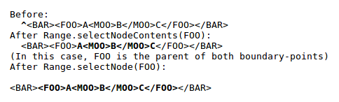
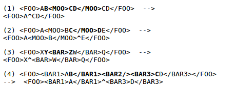
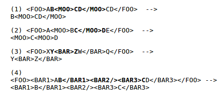

Range接口的完整API描述请参考W3C文档[《Document Object Model Range》]([Rnage](http://www.w3.org/TR/DOM-Level-2-Traversal-Range/ranges.html#Level-2-Range-idl))

>NOTE: 本文中所有的代码示例的完整代码都可以在[Range Demo](./range_demo.html)找到。

##术语##

###Position###

+	一个Range对象包含两个边界点（boundary-points），每个边界点的通过一个节点（node）和偏移量（offset）来唯一定位。
+	如果容器（node）刚好是Attr，Document，DocumentFragment，Element或者EntityReference节点， 偏移量（offset）位于容器子节点的索引区间。
+	如果容器（node）是CharacterData，Comment或者ProcessingInstruction节点，那么偏移量（offset）就是文本（UTF-16编码）字符的索引。
+	如果容器（node）必须是Element，Comment，ProcessingInstruction，EntityReference，CDATASection，Document，DocumentFragment， Attr，或者Text节点的一种。 

###Selection and Partial Selection###

+	如果一个节点或者16bit单位编码的文本位于Range对象的两个边界点支架，我们称为选中（selected）。

>NOTE:	如上图所示，Range2选中了P节点，Range 3选中了text节点“Blah xyz”。

+	如果一个节点包含Range对象的一个边界点，那么这个节点被Range半选（partially selected）。

>NOTE:	如上图所示，Range1就是半选的情况。

##Creating a Range##

__[DocumentRange](http://www.w3.org/TR/DOM-Level-2-Traversal-Range/ranges.html#Level-2-DocumentRange-idl)接口__

	interface DocumentRange {
		Range createRange();
	}

 >NOTE:	createRange返回一个包含默认值的Range对象。默认情况下，这个Range对象的两个边界点node都是Document节点，并且offset值都是0。

###Changing a Range's Position###

可以通过Range.setStart和Range.setEnd两个方法指定Range对象的位置：

	void setStart(in Node parent, in long offset) 
					raises(RangeException);
	void setEnd(in Node parent, in long offset)	
					raises(RangeException);    

当然，还有其他以下方法:

	void setStartBefore(in Node node);
                        	raises(RangeException);
	void setStartAfter(in Node node);
                       		raises(RangeException);
	void setEndBefore(in Node node);
                      		raises(RangeException);
	void setEndAfter(in Node node);
                     		raises(RangeException);
                     		
示例代码：

    var range = document.createRange();
    var id = 'Level-2-Range-introduction-h2';
    var parent = document.getElementById( id );

    range.setStart( parent,0 );
    range.setEnd( parent,1 );
    
    //  2.1. Introduction
    console.log( range.toString() );

一个Range对象是可以在两个边界点收缩的:
	
	void collapse(in boolean toStart);

如果传递的参数是true，那么Range对象会收缩至边界起点，反之则收缩到边界终点。以下方法可以被用来设置Range对象选中Range范围内的节点或者内容。

	void selectNode(in Node n);
	void selectNodeContents(in Node n);

抽象示例 : 

	
示例代码：

    function selectNode_3(){

        var range = document.createRange();
        var start = document.getElementById( 'Level-2-Range-introduction-h2' );
        var end = document.getElementById( 'selecting' );
        var selectedNode = document.getElementById( 'selecting' );

        range.setStart( start,0 );
        //  text node in the P element
        range.setEnd( end.childNodes[1],10 );

        console.log( 'selectNode' );
        range.selectNode( end.getElementsByTagName( 'b' )[0] );
        var nodes = range.extractContents();
        console.log( nodes );

        console.log( 'selectNodeContents' );
        range.selectNodeContents( start );
        var content = range.extractContents();
        console.log( content );

    };

##Deleting Content with a Range##

删除Range对象中选中区间的内容有两种，其中一种就是 **deleteContents** 方法:

	void deleteContents();

抽象示例 : 

值得注意的是，一旦Range对象的deleteContents方法调用之后，Range对象会立刻collapse。

示例代码：

    function deleteContents_1(){

        var start = document.getElementById( 'Level-2-Range-introduction-h2' );
        var end = document.getElementById( 'selecting' );
        var selectedNode = document.getElementById( 'selecting' );

        var range = document.createRange();
        range.setStart( start,0 );
        //  text node in the P element
        range.setEnd( end.childNodes[1],10 );
        //  select '<h2>2.1.Introduction</h2>'
        range.selectNodeContents( start );
        //  delete innerHtml,
        //  if you open console of chrome and see document,you can still find <h2 id="Level-2-Range-introduction-h2" class="div2"></h2>
        range.deleteContents();
        
    };

##Extracting Content##

和 **deleteContents** 不同的是，方法 **extractContents** 只是把Range对象选中的内容从DOM树上分离了，也就是detach，并且作为返回值返回：

	 DocumentFragment extractContents();

抽象示例 : 

示例代码：
	
	function extractContents_1(){

        var start = document.getElementById( 'Level-2-Range-introduction-h2' );
        var end = document.getElementById( 'selecting' );
        var selectedNode = document.getElementById( 'selecting' );

        var range = document.createRange();
        range.setStart( start,0 );
        //  text node in the P element
        range.setEnd( end.childNodes[1],10 );
        //  select '<h2>2.1.Introduction</h2>'
        range.selectNodeContents( start );
        //  delete innerHtml,
        //  if you open console of chrome and see document,you can still find <h2 id="Level-2-Range-introduction-h2" class="div2"></h2>
        var nodes = range.extractContents();

        console.log( nodes );
        
    };

##Cloning Content##

Range对象选中的内容可以被复制下来：

    DocumentFragment cloneContents();

##Inserting Content##

如果要在一个Range对象选中的内容插入新的内容，可以使用以下方法：

    void insertNode(in Node n) raises(RangeException);
    
示例代码：

    function insertNode_1(){

        var start = document.getElementById( 'Level-2-Range-introduction-h2' );
        var end = document.getElementById( 'selecting' );
        var selectedNode = document.getElementById( 'selecting' );

        var range = document.createRange();
        range.setStart( start,0 );
        //  text node in the P element
        range.setEnd( end.childNodes[1],10 );
        //  select '<h2>2.1.Introduction</h2>'
        range.selectNodeContents( start );
        //  delete innerHtml,
        //  if you open console of chrome and see document,you can still find <h2 id="Level-2-Range-introduction-h2" class="div2"></h2>
        range.deleteContents();

        var textNode = document.createTextNode();
        textNode.textContent = '2.1.Introduction';
        range.insertNode( textNode );

    };

##Surrounding Content##

方法 **surroundContents** 其实就像是jQuery的wrap方法，也即是在Range对象选中的内容外面包装一个新的节点：

    void surroundContents(in Node newParent);
    
示例代码 ： 

    function surroundContents_1(){

        var start = document.getElementById( 'Level-2-Range-introduction-h2' );
        var end = document.getElementById( 'selecting' );
        var selectedNode = document.getElementById( 'selecting' );

        var range = document.createRange();
        range.setStart( start,0 );
        //  text node in the P element
        range.setEnd( end.childNodes[1],10 );
        //  select '<h2>2.1.Introduction</h2>'
        range.selectNodeContents( start );
        //  delete innerHtml,
        //  if you open console of chrome and see document,you can still find <h2 id="Level-2-Range-introduction-h2" class="div2"></h2>

        //var textNode = document.createTextNode();
        //textNode.textContent = '2.1.Introduction';
        //range.insertNode( textNode );
        var span = document.createElement( 'span' );
        //<h2 id="Level-2-Range-introduction-h2" class="div2">2.1.Introduction</h2>
        range.surroundContents(span);

    };

##Range modification under document mutation##

##参考文档##

1.	[Document Object Model Range](http://www.w3.org/TR/DOM-Level-2-Traversal-Range/ranges.html)