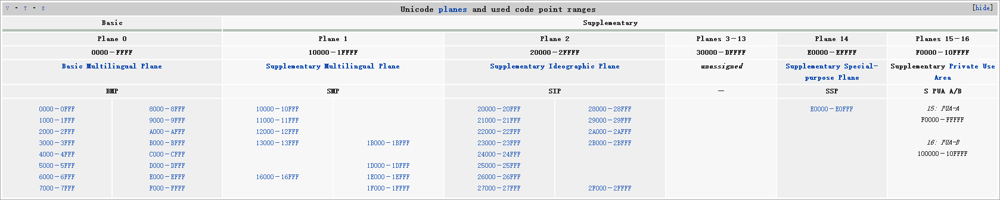
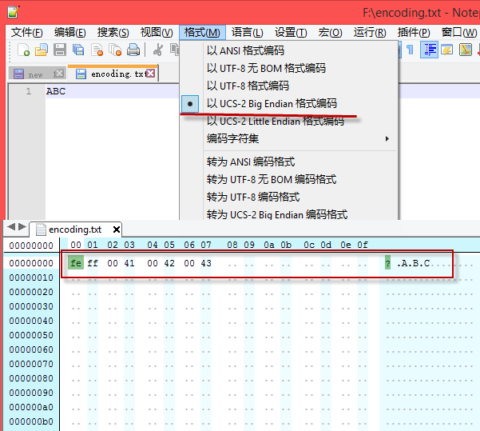

##0.    前言

最近忽然想知道在Javascript引擎中，对于字符串的编码做了哪些处理。因为我稀薄的记忆中，一些比较偏僻的特殊字符，JS是有可能显示成乱码，或者如果你访问其length属性的时候，JS返回的是长度值是2而不是我们直觉上的1。

```
var a = '𠮷';
console.log( a.length );    //    a.length will be 2
```

如此，我开始整理有关的知识点。但我发现如果想要很好的了解JS内部是如何表示字符，首先就要熟悉Unicode以及其相关的知识点。

##1.    Unicode

Unicode（中文：万国码、国际码、统一码、单一码）是为了解决传统的字符编码方案的局限而产生的计算机科学领域里的一项业界标准。它对世界上大部分的文字系统进行了整理、编码，使得电脑可以用更为简单的方式来呈现和处理文字。

Unicode至今仍在不断增修，每个新版本都加入更多新的字符。目前最新的版本为7.0.0，已收入超过十万个字符（第十万个字符在2005年获采纳）。Unicode涵盖的数据除了视觉上的字形、编码方法、标准的字符编码外，还包含了字符特性，如大小写字母。

###1.1.    版本历史

-    Unicode 1.0：1991年10月
-    Unicode 1.0.1：1992年6月
-    Unicode 1.1：1993年6月
-    Unicode 2.0：1997年7月
-    Unicode 2.1：1998年5月
-    Unicode 2.1.2：1998年5月
-    Unicode 3.0：1999年9月；涵盖了来自ISO 10646-1的十六比特通用字符集（UCS）基本多文种平面（Basic Multilingual Plane）
-    Unicode 3.1：2001年3月；新增从ISO 10646-2定义的辅助平面（Supplementary Planes）
-    Unicode 3.2：2002年3月
-    Unicode 4.0：2003年4月
-    Unicode 4.0.1：2004年3月
-    Unicode 4.1：2005年3月
-    Unicode 5.0：2006年7月
-    Unicode 5.1：2008年4月
-    Unicode 5.2：2009年10月
-    Unicode 6.0：2010年10月
-    Unicode 6.1：2012年1月31日
-    Unicode 6.2：2012年9月
-    Unicode 6.3：2013年9月30日
-    Unicode 7.0：2014年6月15日

###1.2.    标准制定的组织

位于美国加州的Unicode组织允许任何愿意支付会费的公司和个人加入，其成员包含了主要的电脑软硬件厂商，例如Adobe、苹果公司、惠普、IBM、微软、施乐等。

###1.3.    Unicode相关概念

**字符和字素**

字符（Characters）和字素（Graphemes）其实是相当类似的概念。每一个Unicode的字符（Characters）都有一个对应的整数编码，而字素（Graphemes）则是各个语言书写的最小单位（比如英文的字母表，中文的汉字等）。

**字形（Glyph）**

每一个字素（Graphemes）都可能会有若干种不同的表现形式。以中文为例，同样的汉字，在不同书法上，其表现形式是不一样的，但语义上一致。

>NOTE: 参考维基百科[Grapheme](http://en.wikipedia.org/wiki/Grapheme)

**编码（Code points）**

Unicode通过Unicode编码（Code points）来表示任意一个字符，每个字符的Code point都是唯一的。通常，一个Unicode编码（Code points）以“U+hhhh”形式表示，其中每一个“h”代表一个十六进制数。

**Unicode架构**

Unicode，从0hex 到 10FFFFhex，一个有1,114,112个code points，划分为0~16一共17个平面（planes）。其中第一个平面称为BMP（Basic Multilingual Plane），其余的从1~16号平面也称为supplementary planes，或者说是informally planes，astral planes都行。



**Unicode assigned characters**

Unicode有定义了一些保留的code points。这些code points并没有定义任何字符：

-    Private Use Area: U+E000..U+F8FF (6,400 characters)
-    Supplementary Private Use Area-A: U+F0000..U+FFFFD (65,534 characters)
-    Supplementary Private Use Area-B: U+100000..U+10FFFD (65,534 characters)

此外，Unicode还定义了一些其他的字符：

-    Graphic characters： Unicode 7.0一共含有112,804个graphic characters
-    Format characters
-    Control code characters： 比如U+0009 (Tab)，U+000A (Line Feed)，U+000D (Carriage Return)

>NOTE: 更多详情，还是参考维基百科——[Unicode](http://en.wikipedia.org/wiki/Unicode)

**UTF（Unicode Transformation Format）**

尽管Unicode规定每个字符的Code point，并且Code point都是确定的，但是却没有指定如何存储和传输。不同的系统平台的设计不同，以及出于节省存储空间的考虑，出现了称为Unicode转换格式（Unicode Transformation Format，简称为UTF）的实现方式。

-    **UTF-1:** 一个已经不再使用的UTF-8前任编码方式，最大兼容至ISO 2022标准，现在已经不再是Unicode标准的一部分了
-    **UTF-7:** 一个7-bit的编码方式，偶尔在email中使用，可以认为已经被放弃使用了（UTF-7并非是Unicode标准的一部分，但是RFC有关于UFT-7的正式文档）
-    **UTF-8:** 8-bit可变长度编码，兼容ASCII
-    **UTF-EBCDIC:** 类似UTF-8的8-bit可变长度编码，但是主要设计用来兼容[EBCDIC字符编码表](http://baike.baidu.com/view/375284.htm)（UTF-EBCDIC也不是Unicode标准的一部分）
-    **UTF-16:** 16-bit可变长度编码
-    **UTF-32:** 32-bit固定长度编码

**Big Endian和Little Endian**

一个字符，可能占据多个字节，比如字符U+ABCD，那么在计算机中，这个字符要如何存储？不同的操作系统的实现不一样，U+FFFF有可能被存储成为AB CD或者CD AB。

如果存储成AB CD，称为[Big Endian](http://en.wikipedia.org/wiki/Endianness#Big-endian)；反之，如果存为CD AB则称为[Little Endian](http://en.wikipedia.org/wiki/Endianness#Little-endian)。

**BOM（Byte order mark）**

[BOM（Byte order mark）](http://en.wikipedia.org/wiki/Byte_Order_Mark)其实就是使用一个未定义任何字符的Unicode Code Point来表示当前的编码是Big Endian还是Little Endian的。

编码方式                |二进制值|
-----------------------|-------------------------|
UTF-16BE               | 00 41 00 42 00 43       |
UTF-16LE               | 41 00 42 00 43 00       |
UTF-16(Big Endian)     | FE FF 00 41 00 42 00 43 |
UTF-16(Little Endian)  | FF FE 41 00 42 00 43 00 |
UTF-16(no BOM)         | 00 41 00 42 00 43       |



**BOM和UTF之间的联系**

上面提到的UTF-16，它使用2个字节来表示一个字符（Character），并且UTF-16其实包含三种不同的存储方式：UTF-16，UTF-16BE（Big Endian）以及UTF-16LE（Little Endian）。

UTF-16BE和UTF-16LE不难理解，而UTF-16就需要通过在文件开头以名为BOM（Byte Order Mark）的字符来表明文件是Big Endian还是Little Endian。BOM为U+FEFF这个字符。

同样道理，UTF-32使用4个字节来表示一个字符（Character），也分为UTF-32、UTF-32BE、UTF-32LE三种编码，其中UTF-32也同样需要BOM字符。

>NOTE: UTF-8不需要BOM，但是Unicode标准是允许UTF-8带上BOM的。UTF-8，UTF-16,以及UTF-32的详细编码经过，自行查阅了，都能写成一本书了。

##2.    UCS

UCS（Universal Character Set，通用字符集）是由ISO制定的ISO 10646（或称ISO/IEC 10646）标准所定义的标准字符集。

###2.1.    UCS编码方式

UCS有三种编码方式：

1.    [UTF-1](http://en.wikipedia.org/wiki/UTF-1)
2.    UCS-2，使用2字节对每个code point进行编码，能够覆盖到BMP里所有的code points
3.    UCS-4，使用4字节对每个code point进行编码，能覆盖UCS所有的code points

UCS-2只能覆盖BMP中的字符，如果你使用的字符在BMP之外的平面，那么就很有可能显示成乱码了。为了解决这个问题，在UCS-2中引入了[辅助平面字符（Surrogate code points）](http://zh.wikipedia.org/wiki/Unicode%E5%AD%97%E7%AC%A6%E5%B9%B3%E9%9D%A2%E6%98%A0%E5%B0%84)就称为UTF-16了。

UTF-16可看成是UCS-2的父集。在没有辅助平面字符（surrogate code points）前，UTF-16与UCS-2所指的是同一的意思。

>NOTE: UTF-16的详细解说，可以阅读维基百科——[UTF-16](http://zh.wikipedia.org/wiki/UTF-16)。

##3.    Unicode和UCS之间的关系

历史上存在两个独立的尝试创立单一字符集的组织，即：

1.    国际标准化组织（ISO）于1984年创建的ISO/IEC
2.    由Xerox、Apple等软件制造商于1988年组成的The Unicode Consortium（统一码联盟）。前者开发的ISO/IEC 10646项目，后者开发的Unicode项目。因此最初制定了不同的标准。

1991年前后，两个项目的参与者都认识到，世界不需要两个不兼容的字符集。于是，它们开始合并双方的工作成果，并为创立一个单一编码表而协同工作。从Unicode 2.0开始，Unicode采用了与ISO 10646-1相同的字库和字码；ISO也承诺，ISO 10646将不会替超出U+10FFFF的UCS-4编码赋值，以使得两者保持一致。两个项目仍都独立存在，并独立地公布各自的标准。

**虽然Unicode和UCS是两个不同的标准**，但我们可以认为Unicode的code points和UCS中的code points是一样的的。目前业界Unicode大行其道，UCS基本淡出视野了。

##4.    Unicode的应用

1.    操作系统，最出名的应该就是Windows NT了。Windows NT内核采用了UTF-16处理字符信息，另外JAVA，.NET以及Mac OS X也是采用了UTF-16作为内部表示。虽然Windows NT内核可以支持全世界所有的语言文字，但现有的大量程序和文档都采用了某种特定语言的编码，例如GBK，Windows不可能不支持现有的编码，而全部改用Unicode。为了解决这一问题，Windows使用[代码页(code page)](http://en.wikipedia.org/wiki/Code_page)来适应各个国家和地区。
1.    输入法
1.    Email
1.    WEB，URI中，非ASCII就必须进行[URL编码](http://en.wikipedia.org/wiki/Percent_encoding)
1.    Fonts，这个比较有趣。Unicode定义了对应的code point但是并没有规定字符的字形，因此同一个字符其实可以对应多一个字形，比如著名的Helvetica字体，或者我自己编程中常用的Console字体。
1.    New lines

>NOTE: 其实代码页我也不是很理解，希望能有读者能分享下。另外，有关Fonts有更多有趣的东西，Apple开发者有一个TrueType Fonts的文档[TrueType Reference Manual](http://developer.apple.com/fonts/ttrefman/)，感兴趣的可以阅读一下。

##5.    参考资料

1.    [JavaScript has a Unicode problem](http://mathiasbynens.be/notes/javascript-unicode)
1.    [JavaScript character escape sequences](http://mathiasbynens.be/notes/javascript-escapes)
1.    [Chapter 24. Unicode and JavaScript](http://speakingjs.com/es5/ch24.html)
1.    [UTF-16](http://en.wikipedia.org/wiki/UCS-2)
1.    [谈谈Unicode编码，简要解释UCS、UTF、BMP、BOM等名词](http://www.52rd.com/Blog/Detail_RD.Blog_thieven_4865.html)
1.    [UCS-2和UCS-4](http://guoxinmiao8.blog.sohu.com/129816401.html)
1.    [Unicode](http://zh.wikipedia.org/wiki/Unicode)
1.    [通用字符集](http://zh.wikipedia.org/wiki/%E9%80%9A%E7%94%A8%E5%AD%97%E7%AC%A6%E9%9B%86)
1.    [Unicode字符平面映射](http://zh.wikipedia.org/wiki/Unicode%E5%AD%97%E7%AC%A6%E5%B9%B3%E9%9D%A2%E6%98%A0%E5%B0%84)
1.    [阮一峰：ECMAScript 6入门](http://es6.ruanyifeng.com/)