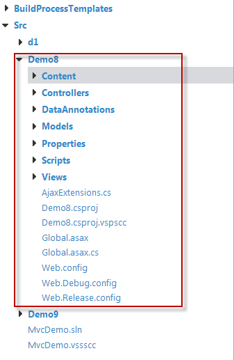

##	ASP.NET MVC

HomeController

	using System;
	using System.Collections.Generic;
	using System.Linq;
	using System.Web;
	using System.Web.Mvc;
	using Demo8.Models;
	
	namespace Demo8.Controllers
	{
	    [HandleError]
	    public class HomeController : Controller
	    {
	        public ActionResult Index()
	        {
	            return View();
	        }
	        public ActionResult Process(UserInfo user)
	        {
	            return Content("Success");
	        }
	 
	        
	        public ActionResult ChildPage() {
	            return PartialView();
	        }
	    }
	}

Index View

	<%@ Page Language="C#" MasterPageFile="~/Views/Shared/Site.Master" Inherits="System.Web.Mvc.ViewPage" %>
	
	<asp:Content ID="indexTitle" ContentPlaceHolderID="TitleContent" runat="server">
	    Home Page
	</asp:Content>
	
	<asp:Content ID="indexContent" ContentPlaceHolderID="MainContent" runat="server">
	
	
	
	    

	    <%=Ajax.ActionLink("载入页面到Div", "ChildPage", new AjaxOptions { UpdateTargetId = "udpatePanel"})%>
	    <a href="javascript:void(0)" onclick="$.get('<%=Url.Action("ChildPage") %>',{},function(r){$('#udpatePanel').html(r)})">载入页面到Div</a>
	    <%=Ajax.JActionLink("载入页面到Div", "ChildPage", new AjaxOptions { UpdateTargetId = "udpatePanel" })%>
	
	    <%=Ajax.ActionLink("载入页面到Div,有确认弹出框", "ChildPage", new AjaxOptions { UpdateTargetId = "udpatePanel", Confirm = "确认加载" })%>
	    <%=Ajax.ActionLink("载入失败", "ChildPage1", new AjaxOptions
		{
		    UpdateTargetId = "udpatePanel",
		    OnFailure = "alert('失败')"
		})%>
	    <%=Ajax.ActionLink("载入成功", "ChildPage", new AjaxOptions
		{
		    UpdateTargetId = "udpatePanel",
		    OnSuccess = "alert('成功')",
		     OnBegin = "alert('开始载入')",
		     OnComplete = "alert('完成')",    
		})%>
		 <%using (Ajax.BeginForm("ChildPage", new AjaxOptions { UpdateTargetId = "udpatePanel", Confirm="ddd" }))
		    %>
	    

	    

	
	</asp:Content>

>NOTE: To read more, see [ASP.NET MVC Demo](http://aspnetmvcdemo.codeplex.com/)

##	EmberJS

URL -> Router -> Route -> Template(A template can optionally have a controller in addition to a model, and can retrieve properties from both)

为什么是这样设计的？这和后端MVC的思路差很多。