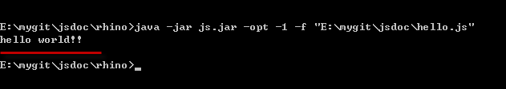

##1.    前言

在前一篇文章中，我提到了，JsDoc是使用一个定制的Mozilla Rhino分支来运行JavaScript，那么本文就紧接着上文，就JsDoc Rhino进行展开讨论。

##2.    JsDoc Rhino

###2.1  JsDoc Rhino的运行环境要求

- Git
- JDK 1.6 (1.7 for invokedynamic)
- Apache Ant
- CVS (to get the tests)

###2.2  获取并且编译JsDoc Rhino

目前JsDoc Rhino托管在了GitHub上，我们可以运行以下命令去过去最近的代码：

    git clone https://github.com/jsdoc3/rhino.git

JsDoc Rhino使用了ant作为项目的构建工具，那么如果我们要打包Rhino，首先切换到Rhino代码的目录，然后运行：

    ant jar

这条命令就会创建一个`build/rhino1_7R3/js.jar`的包。

###2.3  使用JsDoc Rhino运行javascript脚本

编译好了之后，你就可以运行使用以下代码运行Rhino了：

    java -jar build/rhino1_7R3/js.jar

要执行一个简单的脚本，你简单地把脚本文件跟在命令行的后面即可：

    java -jar build/rhino1_7R3/js.jar hello.js

hello.js的源代码如下：

    print( 'hello world!!' );

运行结果如下：
    

想要进一步了解的话，可以查看[官方文档](https://developer.mozilla.org/en-US/docs/Rhino_documentation)。

###2.4  JsDoc Rhino的Build文件

大概的编译过程我们也了解了，我们知道Rhino是使用ant构建的。ant需要编写一个构建的配置文件，一般这个文件应该是`build.xml`。我们的构建命令是`ant jar`。也就是说，我们运行的ant任务名是`jar`。那么通过阅读`build.xml`文件，我们可以找到这个任务：

    <target name="jar" depends="compile-all">
        <copy todir="${classes}" file="LICENSE.txt"/>
        <property name="jarfile" location="${dist.dir}/${rhino.jar}"/>
        <jar jarfile="${jarfile}"
            basedir="${classes}"
            manifest="src/manifest"
            compress="${jar-compression}"
        />
    </target>

从`manifest`清单文件，我们可以知道，当前JsDoc使用的是`1.7R4`版本的Rhino。

    Manifest-Version: 1.0
    Main-Class: org.mozilla.javascript.tools.shell.Main
    Implementation-Version: 1.7R4
    Implementation-Title: Mozilla Rhino 1.7R4
    Implementation-Vendor: Mozilla Foundation
    Implementation-URL: http://www.mozilla.org/rhino

###2.5  Mozilla Rhino 1.7提供的特性

当前Mozilla/Rhino 1.7这个分支已经发布了4版，也就是最新版本是1.7R4。项目的发布说明可以参考以下链接：

1. [New in Rhino 1.7R1](https://developer.mozilla.org/en/docs/New_in_Rhino_1.7R1)
1. [New in Rhino 1.7R2](https://developer.mozilla.org/en/docs/New_in_Rhino_1.7R2)
1. [New in Rhino 1.7R3](https://developer.mozilla.org/en/docs/New_in_Rhino_1.7R3)
1. [New in Rhino 1.7R4](https://developer.mozilla.org/en/docs/New_in_Rhino_1.7R4)

汇总这几个版本，和JavaScript以及JsDOC关系比较大的一些特性如下：

1. JavaScript 1.7
    -   Generators and iterators
    -   Array comprehensions
    -   Block scope with let
    -   Destructuring assignment
2. ECMAScript 5 support
3. JavaScript 1.8 support
4. **CommonJS module support**
    >CommonJS modules are also available in the Rhino shell using the **-modules, -main, and -sandbox command line options**.
4. **JSDoc comment parsing**

##3.    参考文档

[Rhino Hacker Guide](http://ringojs.org/documentation/rhino_hacker_guide)
