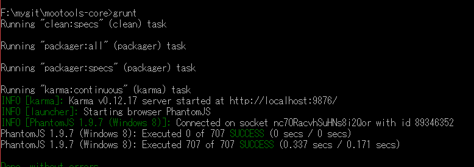

##1.    mootools模块

###1.1.    模块结构

```
/Source
    |--Browser
        |--Browser.js
    |--Class
        |--Class.js
        |--Class.Extras.js
    |--Core
        |--Core.js
    |--Element
        |--Element.js
        |--Element.Style.js
        |--Element.Dimensions.js
        |--Element.Event.js
        |--Element.Delegation.js
    |--Fx
        |--Fx.js
        |--Fx.CSS.js
        |--Fx.Morph.js
        |--Fx.Transitions.js
        |--Fx.Tween.js
    |--Request
        |--Request.js
        |--Request.HTML.js
        |--Request.JSON.js
    |--Slick
        |--Slick.Finder.js
        |--Slick.Parser.js
    |--Types
        |--Array.js
        |--DOMEvent.js
        |--Function.js
        |--Number.js
        |--Object.js
        |--String.js
    |--Utilities
        |--Cookie.js
        |--DOMReady.js
        |--JSON.js
```

###1.2.    模块功能

-    Core：    `MooTools`框架中一些通用的函数，另外在这个模块内，会对原生的Javascript对象，比如Function等做一些拓展。常用的一些拓展框架对象的方法比如：`overloadSetter`，`overloadGetter`，`implement`，`extend`等都是在这个模块里定义的。
-    Types：    拓展Javascript原生对象：Function Array String Event Number。
-    Browser：    浏览器UA嗅探以及操作系统平台监测
-    Class：    定义了Class构造函数，实现了Javascript的类型系统，是`MooTools` 框架的基础。
-    Slick：    CSS选择器引擎。
-    Element：    拓展原生的DOM基类：Element，添加了许多新的api。
-    Fx：    Javascript animation的实现。
-    Request：    AJAX实现。
-    Utilities：    实现一些通用的工具类，比如Cookie，提供了cookie读写功能。

##2.    mootools编译

`MooTools`选择使用`grunt`作为项目构建工具，其所有的`grunt`配置均放在了`Tests\gruntfile-options.js`。

Javascript模块之间必然会有依赖的关系，mootools通过使用了`YAML`格式的包配置文件来搞定这个问题，我们可以在根目录下的`package.yml`发现这些依赖关系：

```javascript
sources:
  - "Source/Core/Core.js"
  - "Source/Types/Array.js"
  - "Source/Types/String.js"
  - "Source/Types/Number.js"
  - "Source/Types/Function.js"
  - "Source/Types/Object.js"
  - "Source/Types/DOMEvent.js"
  - "Source/Browser/Browser.js"
  - "Source/Class/Class.js"
  - "Source/Class/Class.Extras.js"
  - "Source/Slick/Slick.Parser.js"
  - "Source/Slick/Slick.Finder.js"
  - "Source/Element/Element.js"
  - "Source/Element/Element.Style.js"
  - "Source/Element/Element.Event.js"
  - "Source/Element/Element.Delegation.js"
  - "Source/Element/Element.Dimensions.js"
  - "Source/Fx/Fx.js"
  - "Source/Fx/Fx.CSS.js"
  - "Source/Fx/Fx.Tween.js"
  - "Source/Fx/Fx.Morph.js"
  - "Source/Fx/Fx.Transitions.js"
  - "Source/Request/Request.js"
  - "Source/Request/Request.HTML.js"
  - "Source/Request/Request.JSON.js"
  - "Source/Utilities/Cookie.js"
  - "Source/Utilities/JSON.js"
  - "Source/Utilities/DOMReady.js"
```

默认情况下，`grunt`会打包所有的Javascript源代码，并且运行单元测试，如果你只想要打包和压缩Javascript，那么你需要在`Gruntfile.js`里自定义任务：

