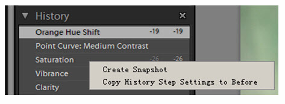

**原文地址**：[History的妙用和虚拟副本（Lightroom技巧）](http://hi.baidu.com/xyeek/item/108bdfe1924840aecf2d4fc9)

Lr将一定数量的调整步骤保存起来，保存步骤的数量可以通过预设菜单设定，默认的步骤为20。
在编辑过程中如果想撤销当前编辑回到上一步，可以在Edit菜单下选Undo……。快捷方式为Ctrl-Z：

单步撤销可以一直向后进行一直到你满意的地方或者初始地方或者Lr的最大记录步骤为止。但更有效的是Lr左侧的History面板（该面板在Develop模块中才可以显示和使用）。
History面板记录的调整顺序是自下而上的，刚调整过的项目位于顶部：

当鼠标悬停在History调整过项目上的时候，在**Navigator下面的缩略图自动显示出那个步骤的效果**，如果单击该项目，则照片就回到该调整项目的状态。
我们在调整一张照片时，要经过很多个步骤，也许我们对这其中的某些步骤实现的效果特别中意，我们可以将此保存为Snapshot（快照），以后不管该张照片处于什么状态，只要单击创建的Snapshot，马上就回到这个状态。
在History的某个步骤中单击鼠标右键，弹出如下图所示的次级选项（直接单击Snapshot后的“+”，也可以创建快照，但这种右击方式有更多的选择）：

① Create Snapshot：创建某一单步的快照，选中后可以为该快照命名，命名后该快照显示在Snapshot栏目下。在Snapshot栏目下右键单击选中的快照可以对其进行重命名、删除等操作：

② Copy History Step Settings to Before：复制包含该步以前的所有调整（与Ps的Action动作非常相似），然后可以**使用Ctrl-Alt-V应用到其它照片中，这些属性并不包括该步骤之后的调整**。与前面提到的属性复制和同步设置比，这种方式在步骤上具有更大的灵活性；而前者在调整项目上灵活性较大。可以根据需要选用或联合使用。

更为方便的是，如果我们要把包含某些步骤的调整作为一个预设也非常方便，单击同在左侧面板的Presets项目右侧的“+”，为预设命名即可。

>NOTE:
>
>除了单步撤销可以删除History中的步骤外，其它任何操作包括对照片进行Reset都不能撤销，Reset只能撤销对照片进行的调整，同时，Reset本身也会被记录到History中。

如果要清除History中的所有步骤记录，单击其右侧的“×”（Clear All）。

在Lr中，还有一个设计得比较巧妙的功能就是建立**虚拟副本**。当调整一张照片时，觉得目前这种效果值得保存，就可以在照片上用鼠标右键单击，弹出快捷菜单，选择“创建虚拟副本”，就完成了。组合快捷键“**Ctrl+'**”更方便。虚拟副本只是个中间修改记录，不是终了文件，占用空间很少。

也可以在底部照片的缩略图上单击建立:

虚拟副本创建后，可以在副本上修改，以副本再创副本，也可以在原片上再创虚拟副本。下图创建了3个虚拟副本，包括原片有四个。原片上“4”这个标记就是这个意思。副本不同于原片，它们的左下角有一个特殊标记。

虚拟副本可以展开，也可以和原片堆叠在一起，也可以通过右键快捷方式来完成。

>NOTE:
>
>如果用菜单的方式将堆叠后的副本展开，它们可能不是紧挨着原片显示而是排列在最后。如果要让副本紧挨着原片显示，只需在原片的堆叠数字上单击即可。这个数字（本例中为“4”）可以在堆叠和展开间切换。
>
>**虚拟副本可以输出为文件**。
