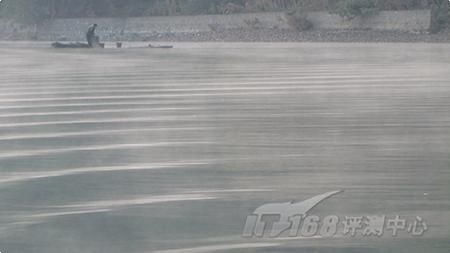
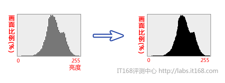
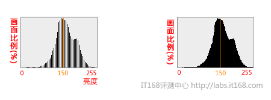
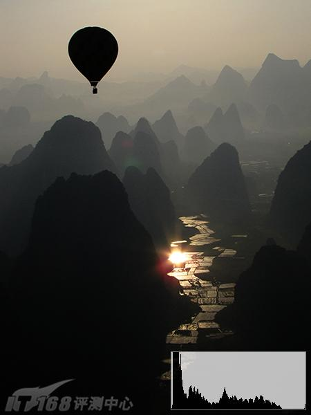
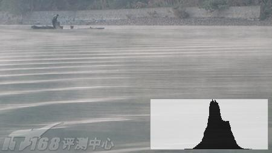
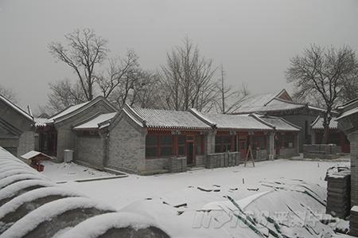
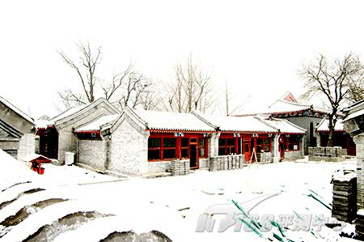
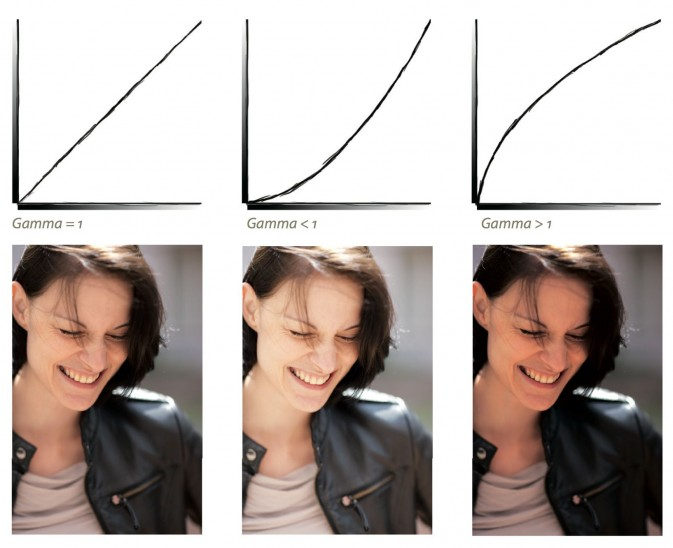

##前言##

数码照片和照片处理之间的内在关系非常复杂...其中有些术语，用在不同的对象和不同的场景下，又有不同的含义。在开始处理照片之前，还是要先了解一些基础知识，否则你最后只能知其一不知其二，单纯地使用处理工具却不理解他们的作用方式（正如我现在所处的局面，软件会用，但是完全不能理解工具处理的原理，当然，知其然正是我学习照片处理基础知识的动力）。

##图像文件##

###矢量图和点阵图###

+	矢量图

矢量图是根据几何特性来绘制图形，矢量可以是一个点或一条线，矢量图只能靠软件生成，文件占用内在空间较小，因为这种类型的图像文件包含独立的分离图像，可以自由无限制的重新组合。它的特点是放大后图像不会失真，和分辨率无关，适用于图形设计、文字设计和一些标志设计、版式设计等。

但是一张图片有无数微小的细节，要把每个细节都加以量化就太复杂了，而且技术上几乎不能实现。所以，数码照片的显示采用的其实是点阵图。

+	点阵图

也叫做位图[bitmap]，删格图像，像素图。简单的说，就是最小单位由像素构成的图，缩放会失真。构成位图的最小单位是像素，位图就是由像素阵列的排列来实现其显示效果的，每个像素有自己的颜色信息。

###像素###

“像素”（Pixel）是由Picture（图像）和Element（元素）这两个单词的字母所组成的，是用来计算数码影像的一种单位，在不同场合，像素含义并非总是相同的：

+	在相机中，像素指一个感光单位，这个单位在感光元件上占一小块地方，特定颜色的亮度能够在这个单位上得以确定。
+	一张数码照片的图像文件是由固定数量的排列在一个网格中的单个图像点组成的，这些图像点就是像素。每个像素都含有一个图像信息，但是没有物理的时机尺寸。所以，像素在图像文件中只是一个逻辑的信息单位，并且只有在**介质**上显示才会获得真实的尺寸。**这种尺寸取决于介质的分辨率。**

###色彩深度###

色彩深度计算机图形学领域表示在位图或者视频帧缓冲区中储存1像素的颜色所用的位数，它也称为位/像素（bpp）。色彩深度越高，可用的颜色就越多。

色彩深度是用“n位颜色”（n-bit colour）来说明的。若色彩深度是n位，即有2种颜色选择，而储存每像素所用的位数就是n。常见的有：

+	1位：2种颜色，单色光，黑白二色，用于compact Macintoshes。
+	2位：4种颜色，CGA，用于gray-scale早期的NeXTstation及color Macintoshes。
+	3位：8种颜色，用于大部分早期的电脑显示器。
+	4位：16种颜色，用于EGA及不常见及在更高的分辨率的VGA标准，color Macintoshes。
+	5位：32种颜色，用于Original Amiga chipset。
+	6位：64种颜色，用于Original Amiga chipset。
+	8位：

--256种颜色，用于最早期的彩色Unix工作站，低分辨率的VGA，Super VGA，AGA，color Macintoshes。
--灰阶，有256种灰色（包括黑白）。若以24位模式来表示，则RGB的数值均一样，例如(200,200,200)。

+	12位：4,096种颜色，用于部分硅谷图形系统，Neo Geo，彩色NeXTstation及Amiga系统于HAM mode。
+	16位：65,536种颜色，用于部分color Macintoshes。
+	24位：16,777,216种颜色，**真彩色**，能提供比肉眼能识别更多的颜色，用于拍摄照片。

另外有高动态范围影像(High Dynamic Range Image)，这种影像使用超过一般的256色阶来储存影像，通常来说每个像素会分配到32+32+32个bit来储存颜色资讯，也就是说对于每一个原色都使用一个32bit的浮点数来储存。

##EXIF、IPTC、XMP元数据##

###EXIF###

[EXIF](http://en.wikipedia.org/wiki/Exchangeable_image_file_format)是一种图象文件格式，它的数据存储与JPEG格式是完全相同的。实际上Exif格式就是在JPEG格式头部插入了数码照片的信息，包括拍摄时的光圈、快门、白平衡、ISO、焦距、日期时间等各种和拍摄条件以及相机品牌、型号、色彩编码、拍摄时录制的声音以及全球定位系统（GPS）、缩略图等。简单地说，Exif=JPEG+拍摄参数。

示例：

<table><tbody><tr><td>
项目

</td><td>
资讯

</td></tr><tr><td>
制造厂商

</td><td>
Canon

</td></tr><tr><td>
相机型号

</td><td>
Canon EOS-1D Mark II

</td></tr><tr><td>
影像方向

</td><td>
正常（upper-left）

</td></tr><tr><td>
影像分辨率 X

</td><td>
72

</td></tr><tr><td>
影像分辨率 Y

</td><td>
72

</td></tr><tr><td>
分辨率单位

</td><td>
dpi

</td></tr><tr><td>
Software

</td><td>
Adobe Photoshop CS Macintosh

</td></tr><tr><td>
最后异动时间

</td><td>
2005:10:06 12:53:19

</td></tr><tr><td>
YCbCrPositioning

</td><td>
2

</td></tr><tr><td>
曝光时间

</td><td>
0.00800 (1/125) sec

</td></tr><tr><td>
光圈值

</td><td>
F1.6

</td></tr><tr><td>
拍摄模式

</td><td>
光圈优先

</td></tr><tr><td>
ISO 感光值

</td><td>
100

</td></tr><tr><td>
EXIF 资讯版本

</td><td>
30,32,32,31

</td></tr><tr><td>
影像拍摄时间

</td><td>
2005:09:25 15:00:18

</td></tr><tr><td>
影像存入时间

</td><td>
2005:09:25 15:00:18

</td></tr><tr><td>
曝光补偿（EV+-）

</td><td>
0

</td></tr><tr><td>
测光模式

</td><td>
点测光 (Spot)

</td></tr><tr><td>
闪光灯

</td><td>
关闭

</td></tr><tr><td>
镜头实体焦长

</td><td>
85 mm

</td></tr><tr><td>
Flashpix 版本

</td><td>
30,31,30,30

</td></tr><tr><td>
影像色域空间

</td><td>
sRGB

</td></tr><tr><td>
影像尺寸 X

</td><td>
800 pixel

</td></tr><tr><td>
影像尺寸 Y

</td><td>
533 pixel

</td></tr></tbody></table>

###IPTC###

[IPTC](http://en.wikipedia.org/wiki/IPTC_Information_Interchange_Model)是国际出版电讯委员会(International Press Telecommunications Council)的缩写，IPTC元数据就是一种标准格式，可以将以下元数据加入照片信息中，如作者，作者联系方式，版权，字幕，细节描述等。

###XMP###

可延伸元数据平台（Extensible Metadata Platform，XMP），是一项由 Adobe Systems 所创建的 ISO 标准[（ISO 16684-1:2012）](http://www.iso.org/iso/home/news_index/news_archive/news.htm?refid=Ref1525)，其目的在于将数位影像资料的元数据标准化。

在我看过PhotoShop产生的XMP文档源代码之后，个人感觉XMP还是非常强大的。PS所有对图像的调整，都能实时记录在XMP文件下而不改变源图像文件，无损处理图片。XMP文件还可以直接使用文本编辑器修改。

既然我是搞技术的，那么我就附上一段XMP文档作为参考吧，请猛击**[这里](./IMG_5314.xmp)**。

##文件格式##

###RAW格式###

这个格式的特点是，感光原件上所有的信息都会被存储下来，无论是相机内置的处理器还是后期的处理操作都不能改变他的图像信息。RAW文件既不能改动，也不能直接处理。

RAW并不是独立并且标准化的，每个相机制造商，都有自己的RAW格式，甚至同一个品牌相机的RAW格式也有一定差异。常见的RAW文件有：

+	.3FR（ 哈苏 ）
+	.ARI（ARRIFLEX）
+	.ARW .SRF .SR2（ 索尼 ）
+	.bay（ 卡西欧 ）
+	.crw .cr2（ 佳能 ）
+	.cap .iiq .eip（Phase_One）
+	.dcs .dcr .drf .k25 .kdc（ 柯达 ）
+	.DNG（ 奥多比 ）
+	.ERF（ 爱普生 ）
+	.FFF（ 易迈康 ）
+	.MEF（ 玛米亚 ）
+	.MOS（ leaf ）
+	.MRW（ 美能达 ）
+	.NEF.NRW（ 尼康 ）
+	.ORF（ 奥林巴斯 ）
+	.PEF.PTX（ 宾得 ）
+	.PXN（ 罗技 ）
+	.R3D（ Red ）
+	.raf（ 富士 ）
+	.raw .rw2（ 松下 ）
+	.raw .rwl .dng（ 莱卡 ）
+	.rwz（Rawzor）
+	.srw（ 三星 ）
+	.X3F（西格玛）

###DNG格式###

全名是Digital negative——数字负片，是Adobe开发的一种用于数码相机生成的原始数据文件的公共存档格式。DNG 解决了不同型号相机的RAW原始数据文件之间缺乏开放式标准的问题，从而有助于确保摄影师们将来能够访问他们的文件。

主要优点：

+	消除了新型号相机采用该格式的潜在障碍，因为新型号相机的原始数据文件将很快获得 Photoshop 及其他应用程序的支持
+	使得商家不再需要开发新格式，且能简化相机测试过程，从而节省了研发费用
+	作为一种通用格式，DNG 使得第三方应用程序能够加强对转换质量的控制
+	该规范允许向 DNG 文件添加专用元数据，从而能实现文件的区分

###JPEG格式###

###TIFF格式###

标签图像文件格式（Tagged Image File Format，简写为TIFF），以**.tif**为扩展名。TIFF最初的设计目的是为了1980年代中期桌面扫描仪厂商达成一个公用的扫描图像文件格式，而不是每个厂商使用自己专有的格式。

这种格式的特点是能保证极高的图像质量，因此它也作为照片处理软件之间的交换格式而被应用于高质量的打印。

###PNG格式###

###PSD格式###

Photoshop Document（PSD），是著名的Adobe公司的图像处理软件Photoshop的专用格式。这种格式可以存储Photoshop中所有的图层，通道、参考线、注解和颜色模式等信息。

PSD格式的文件是一种图形文件格式，因此，使用看图软件如ACDSee 或图形处理软件如我形我速、PhotoShop等都可以打开的。

##图像大小和分辨率##

###图像大小###

这边要弄清楚两个概念，一个是图像大小，一个是图像文件大小。

**图像大小**涉及的是图像中，图像点的数量。以像素乘以像素来说明，其中第一个像素指的是水平方向的像素数量，第二个像素指的是垂直方向的像素数量。例如，一个图片大小可以是4368 x 2912像素，总共12719616像素或者取整为120万像素。

**图像文件大小**和它存储空间有关，以字节为单位。

**图像大小**只是一个虚拟的值，单独这个值既不能以厘米计算，也不能说明显示器上的图像的大小。为了对图像进行确切的描述，还需要**分辨率**这个值。只有通过介质的显示，数字的像素信息才能有一个实际的载体。

###分辨率###

单位长度内包含的像素点的数量，它的单位通常为像素/英寸（ppi）。分辨率也被用于其他的场景下，但是不同场景下，其含义有所不同：

+	镜头分辨率，英文是Resolution，不过在这边其实叫解像力应该更合适。解像力是用来描述缩微摄影系统再现被摄原件细微部分能力的物理量，是影像量评价的重要指标。在物体反差无限大的时候（就是所有物象在纯白和纯黑下）镜头记录物体细节的能力，国际标准单位是 线对/毫米（lp/mm）。当镜头在一毫米的范围内，可以分辩出60根平行线组成的图案，这时我们说这支镜头的光学分辨率为60lp/mm。理论上说分辨率越高的镜头，它成像也越清晰。

+	显示器分辨率是指单位面积显示像素的数量。

一张照片的分辨率其实并没有说明这个图像文件中真正的像素数量。因为在**一个特定介质上**，一张大图和一张小图的**分辨率是一样的**。

**同样的一张图片，分辨率越小，图片显示出来的尺寸就越大。反之，分辨率越高，图片显示出来的尺寸就越小。**

##色调##

色调不是指颜色的性质，是对一幅绘画作品的**整体评价**。一幅绘画作品虽然用了多种颜色，但总体有一种色调，是偏藍或偏红，是偏暖或偏冷等等。

##色阶##

色阶指**亮度**，和颜色无关，但最亮的只有白色，最不亮的只有黑色。关于色阶在PS中的应用，可以参考[详细解说Photoshop色阶的运用](http://www.missyuan.com/viewthread.php?tid=323557)，解说的非常详细，深入浅出。

##对比度##

对比度是最白与最黑**亮度单位**的**相除值**。对比度对视觉效果的影响非常关键，一般来说对比度越大，图像越清晰醒目，色彩也越鲜明艳丽；而对比度小，则会让整个画面都灰蒙蒙的。高对比度对于图像的清晰度、细节表现、灰度层次表现都有很大帮助。

##光比##

[光比](http://baike.baidu.com/view/59936.htm)一般指摄影中，被摄场景的暗部和亮部的受光比例。光比测量可使用外置测光表以入射式测光分别测量亮部暗部。比较光圈值即能算出光比。
如亮部的测光表读数为F11，暗部读数为F8，两次测量快门与感光度不变，则光比为1:2；亮面读数F11，暗部读数F5.6，光比为1：4。规律为1:2^（光圈级差）。超过一级光圈不足两级光圈一般定义为1:3。这是人像摄影中最常用的照明光比。

##灰度##

灰度使用黑色调表示物体,即用黑色为基准色，不同的饱和度的黑色来显示图像。 每个灰度对象都具有从 0%（白色）到100%（黑色）的亮度值。一般，像素值量化后用一个字节（8b）来表示。如把有黑-灰-白连续变化的灰度值量化为256个灰度级，灰度值的范围为0~255，表示亮度从深到浅，对应图像中的颜色为从黑到白。黑白照片包含了黑白之间的所有的灰度色调，每个像素值都是介于黑色和白色之间的256种灰度中的一种。

##动态范围##

**概念**

在摄影技术里面，动态范围则是指拍摄对象的亮度范围——**图像里最暗点到最亮点的亮度跨度**。动态范围既然是一个范围，那么就可以用比值或者差值来进行量化描述。在摄影技术里，我们常采用差值来对动态范围进行量化。我们知道，曝光量每增加一倍或者减少一半，则被称之为增、减1EV**（Exposure Value，曝光级）**，测光表可以测量该区域的亮度为**nEV**。动态范围则可以用场景里**最高亮度与最低亮度区的EV之差**来表述，比如说“为了拍摄柔和的人像照片，我们可以为场景布光或者使用道具，控制其动态范围在3EV之内”，就是指布光完成后，画面里最亮（可能是白色衣物）与最暗（常常是头发）区域的测光值不超过3EV。 

*大动态范围的场景*的场景里，最亮部分与最暗部分相差特别大，画面的对比度高，层次丰富。

*小动态范围的场景*的场景里，多数对象的亮度都差不多，画面对比度低，容易表现出暧昧、朦胧的画面感觉。

**亮度直方图**

亮度直方图是用来体现图像亮度分布的图表，它显示了画面中不同亮度对象所占的画面比例。

举个例子：

假如上图是一幅数码照片的亮度直方图，图中我们指定的橙色竖线最高，它与横轴的交点是150，这就表示这幅照片中，亮度为150的像素在画面中最多。又比如，图中横轴0点处几乎没有柱状图，这就表示该画面中没有亮度为0的点（黑点）。

**动态范围与直方图的关系**

*大动态范围的场景*，其直方图是在整个横轴（亮度）范围内分散开来的：

*小动态范围的场景*，其直方图则比较集中：

##宽容度##

相机的宽容度，就是指它在一次拍摄中所能表现的场景的**最大动态范围**。相机宽容度大小如何影响图像效果呢？举个例子，对于同样的场景，我们模拟宽容度不同的两台相机来拍摄。

如果相机的宽容度**较高**，那么它可以将画面里高光的部分，比如雪花的绒绒的感觉表现出来,同时暗部，比如屋檐下的图案也表现出来:

如果相机的宽容度**很低**，那么画面中高光和较暗的部分都可能表现不好层次，比如雪花的部分变成了全白，而屋檐下的图案则被全黑的区域吞没——这就是所谓的“高光溢出”和“暗部缺失”，都是画面层次不够自然的表现：

>NOTE:上面只是为了演示效果而人为制作的模拟图，同一时期的相机宽容度相差不会这么大。

数码相机的宽容度太大、太小都不好。如果相机的**宽容度太大**，拍摄出的画面显得**平淡，不够鲜明**；但是如果**宽容度太小**，拍出的照片则**过渡生硬，层次缺乏**。 

##高动态范围成像##

高动态范围成像（High Dynamic Range Imaging，简称HDRI或HDR）是用来实现比普通数位图像技术更大曝光动态范围（即更大的明暗差别）的一组技术。高动态范围成像的目的就是要正确地表示真实世界中从太阳光直射到最暗的阴影这样大的范围亮度。

##阴影，中间调，高光##

它们指的是亮度标尺上**某一区域的亮度值**（而不是明确定义的某一个亮度值）所对应的图像区域。换言之，“阴影”是最暗的亮度等级，“高光”是最亮的亮度等级，而“中间调”就是位于这两者之间的亮度等级。

##Gamma值##

伽玛（英文：Gamma）值指印刷技术或图象处理上，输入值和显示器输出时的亮度之间的关系，其影响原稿上高光到暗调之间色调的分布。我们通常可以用一简单的函数来表示：output = input ^ gamma。

Gamma值为1时，显示为一条和水平轴成45°角的对角线，表示照片的对比度正好与其载体（如负片）所能表现的对比度相吻合。Gamma值小于1时，显示为一个黑和纯白，图像的明暗层次明显减少，对比度变低，整张相片的颜色灰常暗淡。Gamma大于1时，显示为一条走向更陡的折线，此时照片的明暗程度增多，对比度变高，而且会导致色阶溢出。如果吧之前的深灰色调当做黑色，把之前的浅灰色调当做白色来显示的话，它就会出现没有细节的图像区域。

>NOTE:其实我觉得Gamma值，和PS中的曲线的概念有点类似。只是PS的曲线我们可以自由调整，而Gamma是预设好了的。

##颜色##

先挖一个超级大坑，以后慢慢填！:-)

##参考文档##

1.	[初略谈谈镜头的分辨率、明锐度和反差](http://club.pchome.net/thread_2_5_266373__.html)
2.	[相机“动态范围”与“宽容度”](http://dcbbs.zol.com.cn/60/752_599184.html)
3.	[真彩色](http://baike.baidu.com/view/189672.htm)
4.	[伽马曲线](http://baike.baidu.com/view/4569667.htm)
5.	[如何通过调节gamma曲线以调节图像的对比度，亮度等参数](http://blog.csdn.net/ipromiseu/article/details/5934064)
6.	[数码摄影区域曝光法实用教程](http://www.nphoto.net/news/2011-02/16/724838dd9483f0cb.shtml)
7.	[伽玛值](http://baike.baidu.com/view/399194.htm)
8.	[中间调人像的拍摄](http://www.chinacamera.com.cn/printpage.asp?ArticleID=1552)
9.	[实例讲解 人像后期的色彩运用点拨](http://photo.poco.cn/special_topic/topic_id-13713-p-2.html)
10.	[教你数码照片当中的色调知识](http://photo.poco.cn/special_topic/topic_id-14773-p-1.html)
11.	[给你一点颜色：色彩摄影知识大专题](http://photo.poco.cn/special_topic/topic_id-11061.html)
12.	[玩转中性灰 轻松调颜色](http://photo.poco.cn/special_topic/topic_id-6410-p-1.html)
13.	[专业摄影师的选择 色彩空间最大化(上)](http://academy.fengniao.com/74/746646.html)
14.	[新手入門的必修學分： 色彩 與 攝影 之間的關聯](http://digiphoto.techbang.com/posts/1579-rgb-color-space-with?page=1)
15.	[色彩管理難掌控？不妨從基本先瞭解起！](http://digiphoto.techbang.com/posts/808-difficult-to-control-the-color-management-may-wish-to-play-from-basic-to-understand)
16.	[详细解说Photoshop色阶的运用](http://www.missyuan.com/viewthread.php?tid=323557)