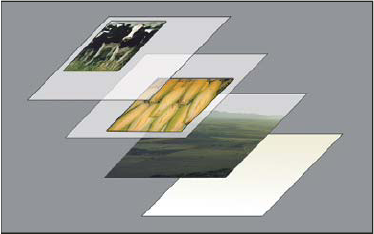

##前言##

##选区和抠图##

###选区工具###

+	使用几何形状创建选区
+	使用线条创建选区——套索工具
+	用颜色创建选区——魔棒工具
+	用路径创建选区——结果最准确，操作起来最舒服的创建选区方法。
+	用图层蒙版创建选区

###抠图###

选区的存在就是要对选定的对象进行单独处理，接下来所有的处理步骤都只是作用于被选定的区域。你可以编辑，复制，裁剪或者删除选定对象。

当然如果你想要编辑选中区域以外的其他图像元素，你首先要进行反选选区。

你还可以把**选区转换成图层蒙版**，如此一来，你进行后面的处理工作时，将会更加灵活。这一方法的有点在于，当你删除某个图像区域或者抠图之后，图像本身还能保持原封不动。

##图层##

图层就如同堆叠在一起的透明纸。您可以透过图层的透明区域看到下面的图层。可以移动图层来定位图层上的内容，就像在堆栈中滑动透明纸一样。也可以更改图层的不透明度以使内容部分透明。

