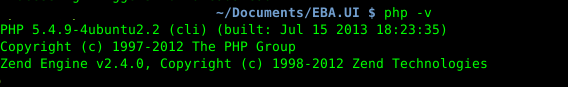
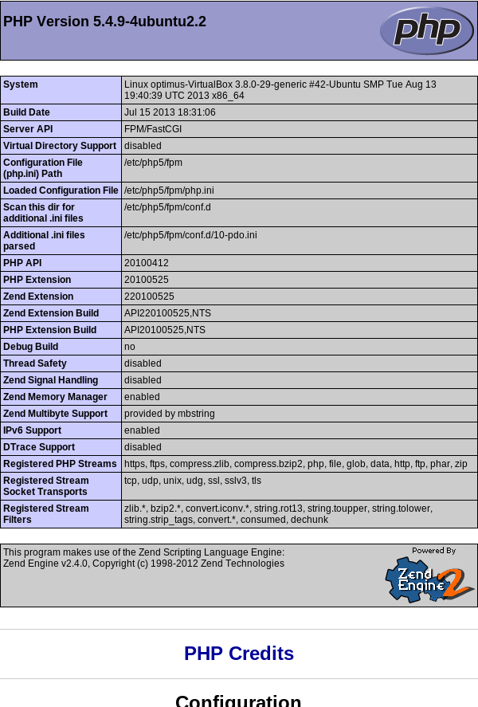

##安装php5##

在linux下安装PHP简直太容易了，一行命令搞定一切：

	sudo apt-get -y install php5-common php5-cli php5-fpm

之后我们可以运行一下命令检查一下是否已经安装成功了：

	php -v

##安装nginx##

如果你还米有安装nginx的话，请参考我的另外一篇博文[在ubuntu下安装nginx](http://my.oschina.net/knightuniverse/blog/157869)

##配置php5##

我们需要修改一下fpm的配置文件:
	
	sudo gedit /etc/php5/fpm/php.ini

找到**cgi.fix_pathinfo=1**这一行,然后把1改成0：

	cgi.fix_pathinfo=0

cgi.fix_pathinfo=0 表示**关闭** PHP 的自动 PATH_INFO 检测。cgi.fix_pathinfo=1的时候，举个例子，当nginx传给 PHP 的值为 /var/www/lrenwang/test.png/xxx.php的时候，$_SERVER 中 SCRIPT_FILENAME 却是 /var/www/test/test.png。

因为/var/www/lrenwang/test.png/xxx.php 并不存在，/var/www/lrenwang/test.png 被 PHP 解析为 SCRIPT_FILENAME，/xxx.php 被 PHP 解析为 PATH_INFO 后被丢弃，因此并没有在 $_SERVER 中出现。当cgi.fix_pathinfo设置为0的时候则不会有此问题。

另外，我们需要检查一下php5-fpm的配置，可能还需要一点小修改。打卡www.conf这个文件:

	 sudo gedit /etc/php5/fpm/pool.d/www.conf

找到**listen = 127.0.0.1:9000**, 把**127.0.0.1:9000**改成**/var/run/php5-fpm.sock**。

	listen = /var/run/php5-fpm.sock

之后重启：

	sudo service php5-fpm restart

>NOTE:我这边安装完php-fpm后，这个listen地址就是正确的了。

>另外，这里稍微提一下FastCGI的运作原理。Nginx不支持对外部程序的直接调用或者解析，所有的外部程序（包括PHP）必须通过FastCGI接口来调用。FastCGI接口在Linux下是socket（这个socket可以是文件socket，也可以是ip socket）。为了调用CGI程序，还需要一个FastCGI的wrapper（wrapper可以理解为用于启动另一个程序的程序），这个wrapper绑定在某个固定socket上，如端口或者文件socket。当Nginx将CGI请求发送给这个socket的时候，通过FastCGI接口，wrapper接收到请求，然后派生出一个新的线程，这个线程调用解释器或者外部程序处理脚本并读取返回数据；接着，wrapper再将返回的数据通过FastCGI接口，沿着固定的socket传递给Nginx；最后，Nginx将返回的数据发送给客户端。这就是Nginx+FastCGI的整个运作过程，如图所示：

>

##配置nginx##

打开默认站点配置文件：

	sudo gedit /etc/nginx/sites-available/default

修改如下所示，你可以参开:

	server {
        listen   80;
        
        root /usr/share/nginx/www;
        index index.php index.html index.htm;

        server_name example.com;

        location / {
                try_files $uri $uri/ /index.html;
        }

        error_page 404 /404.html;

        error_page 500 502 503 504 /50x.html;
        location = /50x.html {
              root /usr/share/nginx/www;
        }

        # pass the PHP scripts to FastCGI server listening on 127.0.0.1:9000
        location ~ \.php$ {
                #fastcgi_pass 127.0.0.1:9000;
                # With php5-fpm:
                fastcgi_pass unix:/var/run/php5-fpm.sock;
                fastcgi_index index.php;
                fastcgi_param SCRIPT_FILENAME $document_root$fastcgi_script_name;
                include fastcgi_params;  
        }

	}

修改如下:

+	在index这一行添加index.php
+	修改server_name为你的域名或者IP
+	修改 “location ~ \.php$ {“ 配置节

##测试php页面##

要测试nginx是否配置成功，我们可以新建一个PHP页面:
	
	sudo touch /usr/share/nginx/www/info.php
	sudo gedit /usr/share/nginx/www/info.php
	
输入以下PHP源代码：

    <?php
        phpinfo();
    ?>

重启nginx：

	sudo service nginx restart

然后访问http://youripaddress/info.php这个页面查看结果

##参考文档##

1.	[How to Install Linux, nginx, MySQL, PHP (LEMP) stack on Ubuntu 12.04](https://www.digitalocean.com/community/articles/how-to-install-linux-nginx-mysql-php-lemp-stack-on-ubuntu-12-04)

2.	[PHP基础教程](http://www.w3school.com.cn/php/)

3.	[PHP 类与对象](http://www.5idev.com/p-php_class_object.shtml)